# @quantumaudio/ableton-extension-sdk

**Look like you belong in Live.** HTML, CSS, and Vue primitives that mirror Ableton’s extension webview styling — dark *and* light, device knobs and faders, waveforms, dialogs that feel native.

No `@ableton-extensions/sdk` here. This is the paint and paneling; your extension brings the engine.

License: [Apache-2.0](LICENSE). Ships **TypeScript/Vue source** (consumers bundle with esbuild or Vite).

---

## Why this exists

Building an Ableton extension should not mean reinventing pill buttons, modal chrome, rotary knobs, and “why does my webview look like a 2009 blog.” QuantumAudio extensions ([Intricator](https://github.com/QaAudio), MCP kernel, QuantumAgent) all share this kit so:

- **Themes track Live** — flip `data-qa-theme` between dark and light tokens.
- **Layouts match real extensions** — toolbar → panel → status bar, plus synth/device/mixer UIs.
- **CSS works without Vue** — ship a tiny HTML panel for buttons, sliders, and selects.

---

## Gallery

Run the interactive gallery locally:

```bash
npm run dev:examples
```

Then open [http://127.0.0.1:5199](http://127.0.0.1:5199). Toggle layouts in the sidebar, mash the theme button, resize the window — these demos target the narrow webview column Live gives you.

### Extension shell (dark / light)

The full sandwich: project toolbar, session panel with pending-change badge, status bar with connection indicator. Pattern lifted from Intricator.

| Dark | Light |
|------|-------|
| 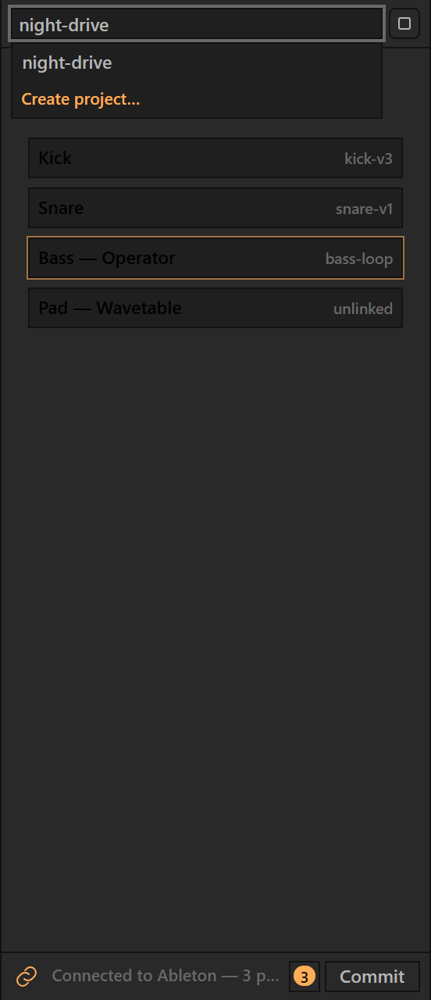 | 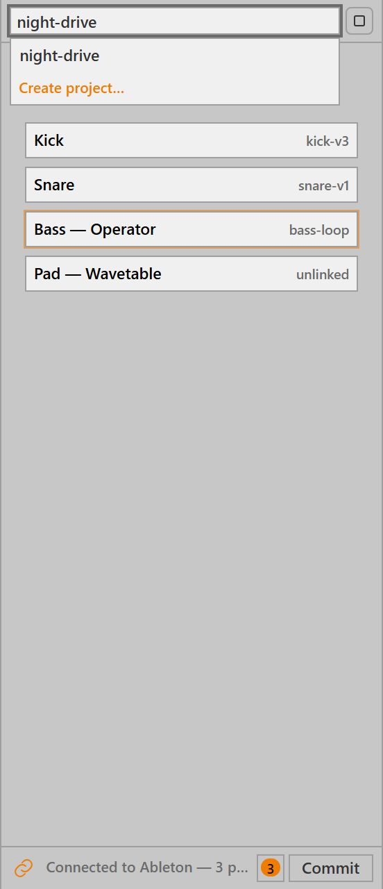 |

### Effect panel

Device-style parameter rows — drive, tone, mix, bypass. Copy this for audio/MIDI utilities.

| Dark | Light |
|------|-------|
| 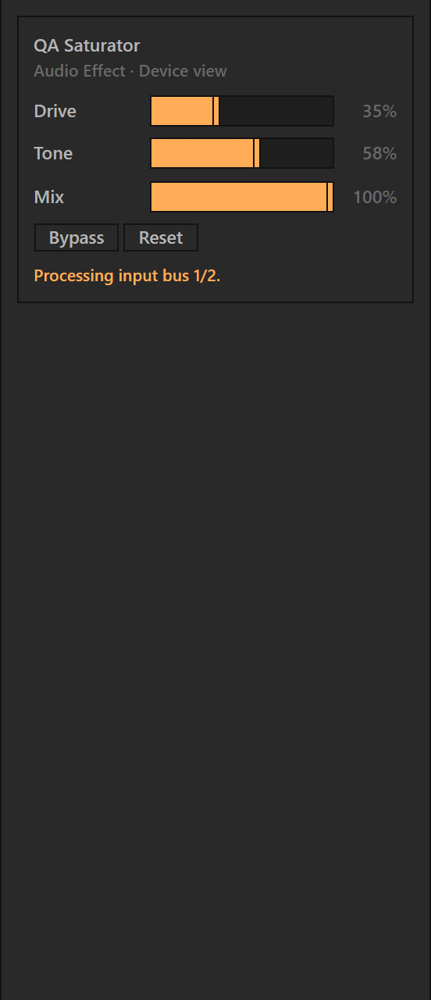 | 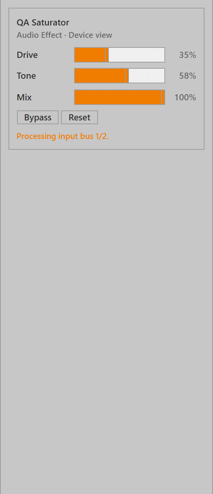 |

### Rename dialog

Modal form with `QaDialog` + `QaTextInput`. Escape to cancel, Enter to submit — same ergonomics as SDK examples.

| Dark | Light |
|------|-------|
| 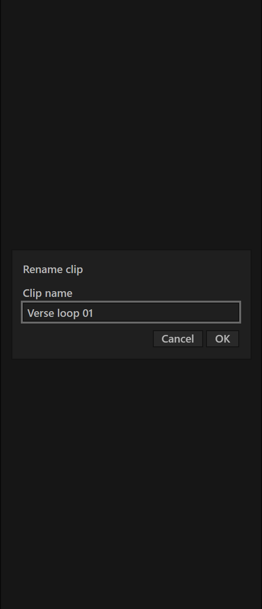 | 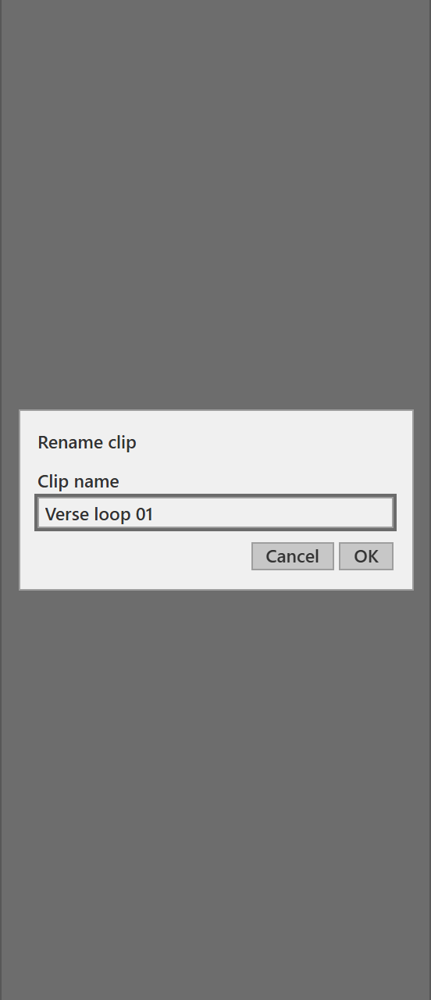 |

### Instrument device

Synth-style device chrome with knobs, segmented tabs, filter select, and value field.

| Dark | Light |
|------|-------|
| 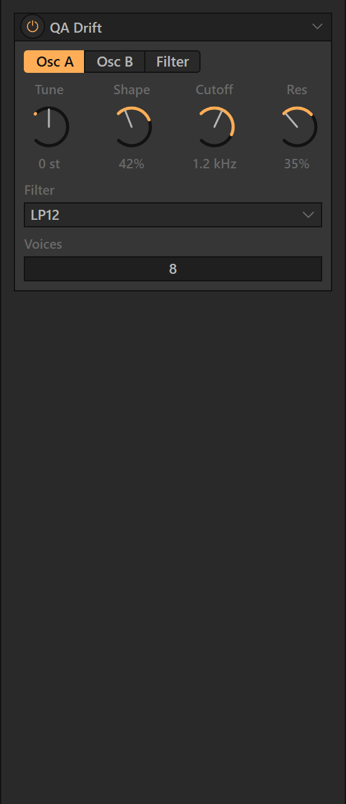 | 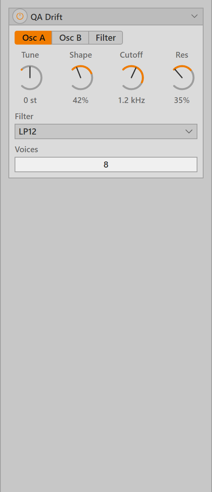 |

### Channel strip

Mixer strip: pan, sends, fader, stereo meter, mute/solo/arm toggles.

| Dark | Light |
|------|-------|
| 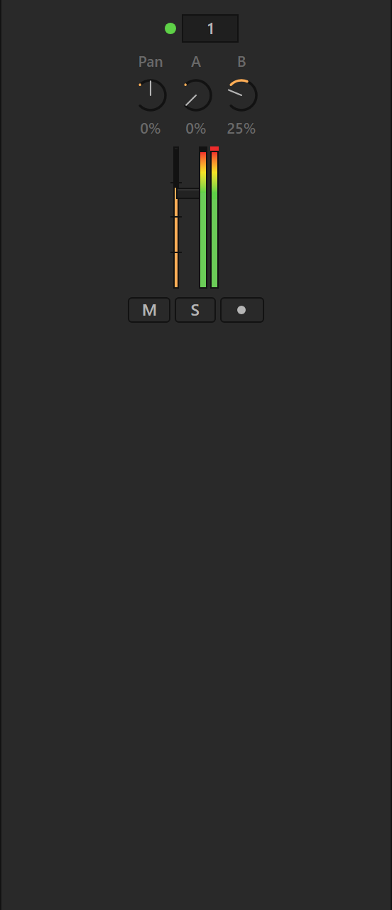 | 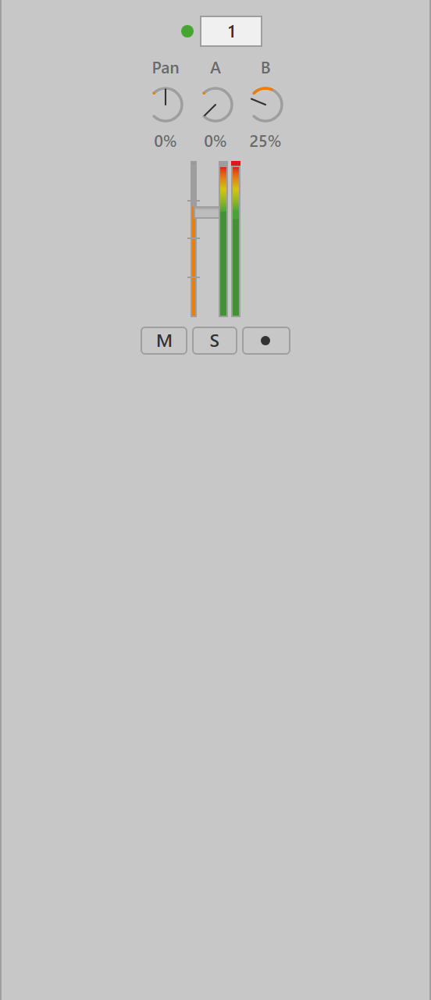 |

### Sample editor

Interactive waveform with playhead, selection, transport, warp mode, and loop toggle.

| Dark | Light |
|------|-------|
| 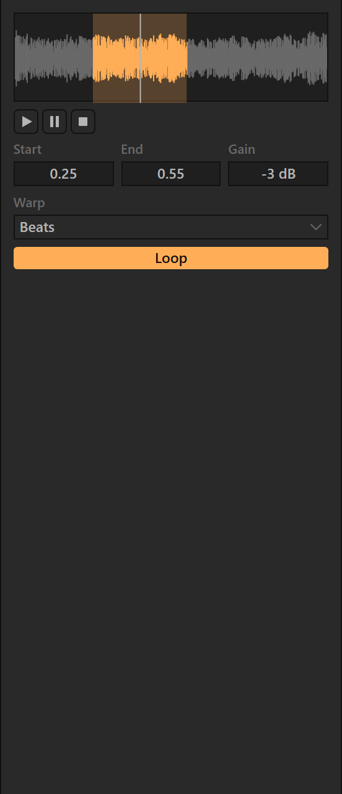 | 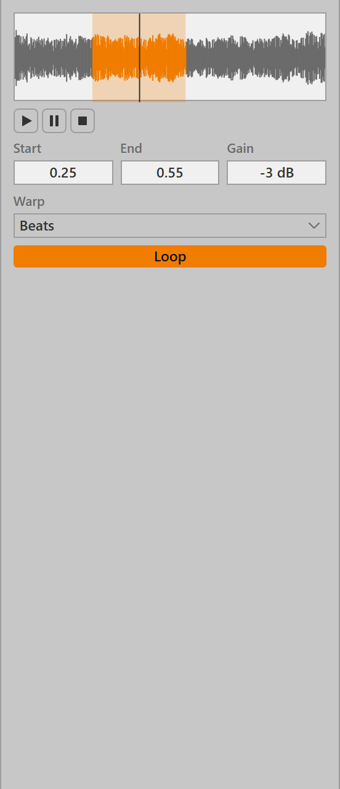 |

### FX chain

Device panels with XY pad, fold, and power states.

| Dark | Light |
|------|-------|
| 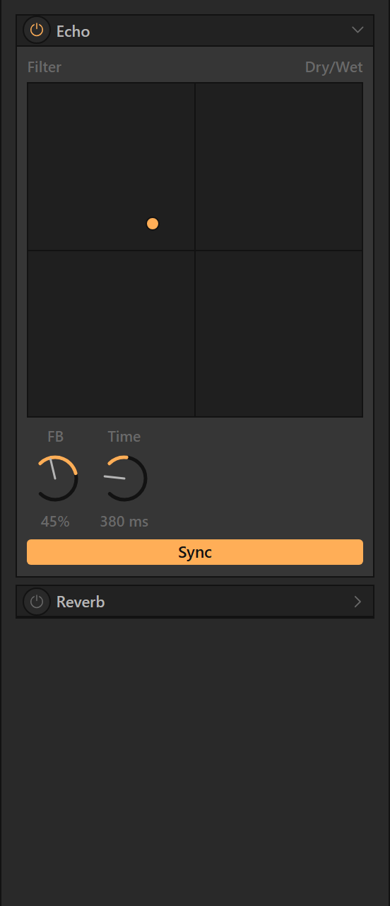 | 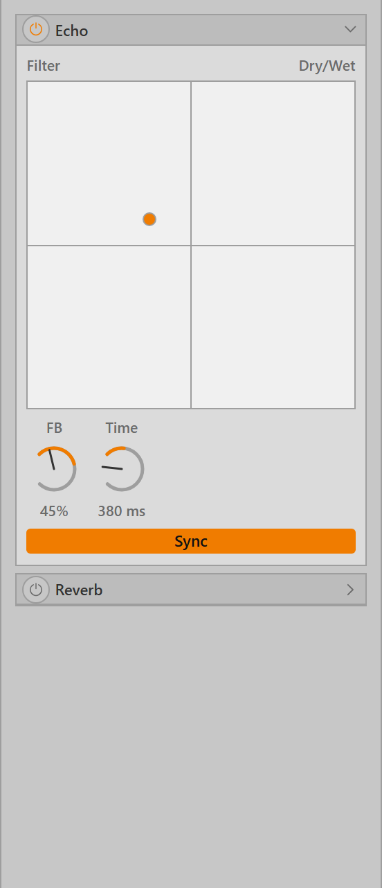 |

### Synth playground

Web Audio demo — power on to hear a live synth with meter and waveform (idle state in screenshots).

| Dark | Light |
|------|-------|
| 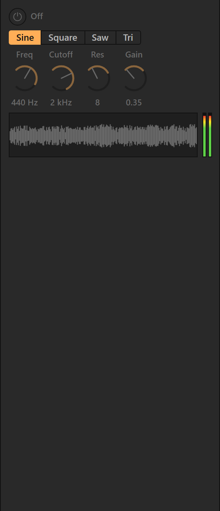 | 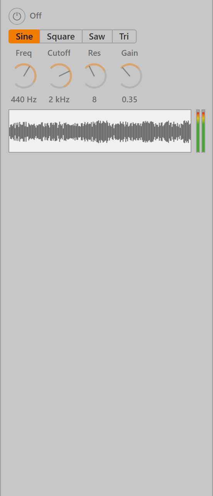 |

### More layouts

- **Project toolbar** — link/sync actions + autocomplete ([dark](docs/screenshots/project-toolbar-dark.png) · [light](docs/screenshots/project-toolbar-light.png))
- **Status chrome** — connection glyph, info action, embedded theme toggle ([dark](docs/screenshots/status-chrome-dark.png) · [light](docs/screenshots/status-chrome-light.png))

Source for every layout: [`examples/vue/src/layouts/`](examples/vue/src/layouts/). Static HTML demos (buttons, sliders, select — no build step): [`examples/`](examples/).

Regenerate screenshots after UI changes:

```bash
npm run screenshots
```

---

## Install

```bash
npm install @quantumaudio/ableton-extension-sdk
```

**Peer dependency:** `vue` ^3.5 (Vue components only). Plain CSS entry points work without Vue.

Requires **Node ≥ 24** for typechecking.

---

## Entry points

| Import | Use |
|--------|-----|
| `@quantumaudio/ableton-extension-sdk` | Theme provider, dialog helpers, param utils, peak extraction |
| `@quantumaudio/ableton-extension-sdk/vue` | Vue 3 components |
| `@quantumaudio/ableton-extension-sdk/theme.css` | CSS variables / theme |
| `@quantumaudio/ableton-extension-sdk/styles.css` | Bundled component styles |
| `@quantumaudio/ableton-extension-sdk/button.css` | À la carte CSS |
| `@quantumaudio/ableton-extension-sdk/slider.css` | Horizontal parameter slider |
| `@quantumaudio/ableton-extension-sdk/knob.css` | Rotary knob (use with `QaKnob`) |
| `@quantumaudio/ableton-extension-sdk/fader.css` | Vertical fader |
| `@quantumaudio/ableton-extension-sdk/meter.css` | Level meter |
| `@quantumaudio/ableton-extension-sdk/device.css` | Device panel chrome |
| `@quantumaudio/ableton-extension-sdk/waveform.css` | Waveform canvas |
| `@quantumaudio/ableton-extension-sdk/input.css` | Text inputs, dialogs |
| `@quantumaudio/ableton-extension-sdk/select.css` | Native select styling (via `styles.css`) |

---

## Components

### Chrome & layout

| Component | Purpose |
|-----------|---------|
| `QaToolbar` | Horizontal tool row |
| `QaPanel` | Labeled content panel |
| `QaStatusBar` | Bottom status line |
| `QaDevicePanel` | Live device title bar with power, fold, and body |
| `QaDialog` | Modal overlay |
| `QaWindowControls` | Electron minimize/maximize/close |

### Buttons & toggles

| Component | Purpose |
|-----------|---------|
| `QaButton` / `QaIconButton` | Pill and icon buttons |
| `QaButtonGroup` | Joined button row |
| `QaToggle` | Square on/off device button |
| `QaPowerButton` | Round device power switch |
| `QaSegmented` | Tab-style segmented control |
| `QaBadge` | Numeric/status badge |
| `QaLed` | Tiny round indicator |

### Parameters

| Component | Purpose |
|-----------|---------|
| `QaSlider` | Horizontal device parameter slider |
| `QaKnob` | Rotary macro knob (drag + keyboard) |
| `QaFader` | Vertical mixer fader |
| `QaValueField` | Draggable/editable number box |
| `QaXYPad` | 2D XY control pad |
| `QaSelect` | Native chooser dropdown |

### Meters & visualization

| Component | Purpose |
|-----------|---------|
| `QaMeter` | Mono/stereo level meter (consumer-driven levels) |
| `QaWaveform` | Canvas waveform with playhead, selection, seek |
| `QaWaveformThumb` | Compact list thumbnail |

### Inputs & dialogs

| Component | Purpose |
|-----------|---------|
| `QaTextInput` | Labeled text field |
| `QaAutocomplete` | Filterable dropdown with optional create |
| `QaThemeToggle` | Dark/light theme switch |

### Usage snippets

**Knob with log frequency taper:**

```vue
<script setup lang="ts">
import { ref } from "vue";
import { QaKnob } from "@quantumaudio/ableton-extension-sdk/vue";
import { formatHz } from "@quantumaudio/ableton-extension-sdk";

const cutoff = ref(1200);
</script>

<template>
  <QaKnob
    v-model="cutoff"
    label="Cutoff"
    :min="20"
    :max="20000"
    taper="log"
    :format="formatHz"
  />
</template>
```

**Waveform with fake peaks (demo/screenshot):**

```vue
<script setup lang="ts">
import { fakePeaks } from "@quantumaudio/ableton-extension-sdk";
import { QaWaveform } from "@quantumaudio/ableton-extension-sdk/vue";

const peaks = fakePeaks("my-clip", 400);
</script>

<template>
  <QaWaveform :peaks="peaks" :height="64" interactive />
</template>
```

**Device panel:**

```vue
<script setup lang="ts">
import { ref } from "vue";
import { QaDevicePanel, QaKnob } from "@quantumaudio/ableton-extension-sdk/vue";

const enabled = ref(true);
const mix = ref(50);
</script>

<template>
  <QaDevicePanel v-model:enabled="enabled" title="QA Saturator">
    <QaKnob v-model="mix" label="Mix" :min="0" :max="100" unit="%" />
  </QaDevicePanel>
</template>
```

> Knobs, faders, meters, XY pads, and waveforms are **Vue components**. Only buttons, sliders, labels, and `.qa-select` have standalone CSS demos.

---

## Audio utilities

Framework-free helpers exported from the main entry:

| Export | Purpose |
|--------|---------|
| `decodeWavPeaks(bytes, buckets)` | Bucketed peaks from WAV bytes |
| `peaksFromAudioBuffer(buffer, buckets)` | Peaks from Web Audio `AudioBuffer` |
| `fakePeaks(seed, buckets)` | Deterministic demo peaks |
| `normalize` / `denormalize` | Linear/log parameter mapping |
| `formatDb` / `formatHz` / `formatPercent` | Display formatters |

```ts
import { decodeWavPeaks, fakePeaks } from "@quantumaudio/ableton-extension-sdk";

const fromWav = decodeWavPeaks(wavBytes, 200);
const demo = fakePeaks("kick-01", 120);
```

---

## Quick start

**1. Theme + styles** (extension webview or Vite app):

```ts
import { createThemeProvider } from "@quantumaudio/ableton-extension-sdk";
import "@quantumaudio/ableton-extension-sdk/theme.css";
import "@quantumaudio/ableton-extension-sdk/styles.css";

createThemeProvider(document.documentElement, { defaultTheme: "dark" });
```

**2. Vue panel** — steal a layout from the gallery or compose your own:

```vue
<script setup lang="ts">
import {
  QaButton,
  QaPanel,
  QaStatusBar,
  QaThemeToggle,
  QaToolbar,
} from "@quantumaudio/ableton-extension-sdk/vue";
</script>

<template>
  <main class="qa-app">
    <QaToolbar><!-- tools --></QaToolbar>
    <QaPanel label="My extension" grow><!-- body --></QaPanel>
    <QaStatusBar message="Ready." />
    <QaThemeToggle />
  </main>
</template>
```

Extensions typically bundle with esbuild (`loader: { ".html": "text" }` per the [Extensions SDK](https://ableton.github.io/extensions-sdk/)). The Vue gallery uses Vite with aliases — see [`examples/vue/vite.config.ts`](examples/vue/vite.config.ts).

---

## Development

```bash
git clone https://github.com/QaAudio/qa-ableton-extension-sdk.git
cd qa-ableton-extension-sdk
npm ci
npm run typecheck
npm run dev:examples   # Vue layout gallery
```

| Script | What it does |
|--------|----------------|
| `npm run typecheck` | `vue-tsc` on library source |
| `npm run dev:examples` | Vite dev server for Vue layouts |
| `npm run build:examples` | Production build of the gallery |
| `npm run screenshots` | Rebuild gallery + capture `docs/screenshots/` |

---

## Related projects

| Project | Repo |
|---------|------|
| MCP + Live agent stack | [qa-ableton-mcp](https://github.com/QaAudio/qa-ableton-mcp) |
| Knowledge / SDK docs search | [qa-knowledge](https://github.com/QaAudio/qa-knowledge) + [qa-knowledge-mcp](https://github.com/QaAudio/qa-knowledge-mcp) |

---

## Contributing

PRs welcome. Keep CSS token-driven; avoid hard-coded colors outside `src/theme/`. See [AGENTS.md](AGENTS.md).

If you add a component, give it a row in the gallery or a static HTML demo, register it in `scripts/capture-screenshots.mjs`, and re-run `npm run screenshots`.
